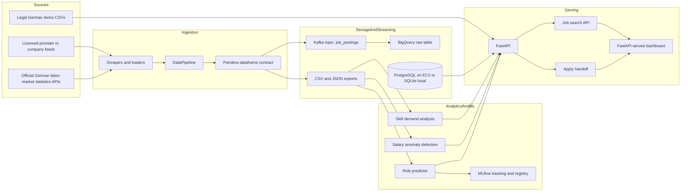

# Job Market Intelligence Platform

A data and ML platform for German job search and job-market intelligence: searching jobs across professions, validating ingestion quality, analyzing skill and EUR salary trends, tracking role-prediction experiments, and exposing the results through a FastAPI service.

The project is built as a portfolio-grade slice of a real analytics system: typed configuration, schema contracts, reproducible local workflows, MLflow experiment tracking, tests around data and model behavior, and cloud deployment scaffolding.

## Demo Status

- Public deployment: currently stopped.
- Local dashboard: [http://localhost:8000](http://localhost:8000) after running `make serve`
- Local API docs: [http://localhost:8000/docs](http://localhost:8000/docs) after running `make serve`

Public cloud deployment now defaults to a one-host AWS EC2 path using Docker Compose, GHCR images, and a local Postgres container. Terraform/ECS, RDS, load balancers, NAT gateways, and Kubernetes are kept as optional production scaffolding because they can create AWS charges. See [INFRASTRUCTURE.md](INFRASTRUCTURE.md) for the deployment path.

## System Architecture



## How Data Flows

1. `DataPipeline` pulls job postings only from approved sources for the current stage: local legal demo CSVs, licensed providers, official APIs, or company feeds with explicit permission. Unapproved live scraping paths are blocked at the API boundary.
2. Source records are normalized into `JobPosting` models, then converted into a dataframe at pipeline boundaries.
3. A Pandera schema validates the outgoing batch before Kafka publishing or CSV/JSON export. Required fields must be present, salaries must be positive when provided, `salary_max` cannot be below `salary_min`, and `posted_date` cannot be in the future.
4. Validated data can be exported locally, sent to Kafka, loaded into BigQuery by the consumer, or used directly by analytics modules.
5. Analytics services compute skill demand, related skills, EUR salary premiums, and salary anomalies for the German market demo dataset.
6. The role predictor builds text, categorical, and numeric features, trains a scikit-learn model, and logs metrics/artifacts/model versions to MLflow.
7. FastAPI serves job search, apply handoff, source governance, pipeline status, job statistics, skill reports, role forecasts, salary anomaly results, and CSV exports.
8. The root route renders the v1 job-search product: search any profession in Germany, inspect matching jobs, compare salaries and companies, and open apply/source links when available.

## Data Source Strategy

The project intentionally separates **job listings** from **market context**.

Job listings require a source that legally allows storing, serving, and linking to application pages. The current default is `legal_demo_csv`, which keeps tests and local development reproducible. Future live listings should come from licensed providers, company feeds with explicit permission, or official APIs with clear terms.

Market context can use larger no-cost official sources, but these do not replace job postings:

- Eurostat job vacancy statistics for aggregate vacancy context
- Bundesagentur fuer Arbeit statistics APIs for German labour-market indicators
- EURES vacancy statistics for occupation/location/contract-type context
- ESCO for occupation and skill normalization

The backend blocks unapproved live sources through `/data/fetch` and reports source status through `/data/governance`. See [ADR 009](docs/decisions/009-legal-data-and-source-strategy.md) for the detailed research, tradeoffs, and decision.

## Key Design Decisions

- **Kafka is included as a streaming boundary, not just decoration.** Ingestion validates records before publishing to the `job_postings` topic, and the consumer is responsible for BigQuery loading. The rationale is documented in [docs/decisions/001-why-kafka.md](docs/decisions/001-why-kafka.md).
- **The public demo uses one EC2 instance rather than managed AWS services.** Docker Compose keeps the FastAPI app and Postgres deployment understandable and low-cost for a portfolio demo. See [docs/decisions/002-why-one-ec2-docker-compose.md](docs/decisions/002-why-one-ec2-docker-compose.md).
- **Postgres runs as a local container for the first cloud demo.** RDS remains a future production option, but the current path avoids an extra managed database bill. See [docs/decisions/003-why-local-postgres-container.md](docs/decisions/003-why-local-postgres-container.md).
- **Local legal seed listings are used intentionally.** This keeps search, detail, and apply workflows reproducible while avoiding claims of live market coverage before an approved listing source is connected. See [docs/decisions/004-why-data-for-public-portfolio.md](docs/decisions/004-why-data-for-public-portfolio.md).
- **Legal data sourcing is explicit.** Individual job listings require approved listing sources, while official open statistics are used only as market context. See [docs/decisions/009-legal-data-and-source-strategy.md](docs/decisions/009-legal-data-and-source-strategy.md).
- **GitHub Actions and GHCR provide the first CI/CD path.** The EC2 host pulls a built image instead of building from source on the instance. See [docs/decisions/005-why-github-actions-ghcr.md](docs/decisions/005-why-github-actions-ghcr.md).
- **The demo is focused on Germany.** German roles, cities, and EUR salary ranges make the product story more specific and credible. See [docs/decisions/006-why-german-market-focus.md](docs/decisions/006-why-german-market-focus.md).
- **The frontend is served by FastAPI for v1.** This keeps the deployment as one app container while the product workflow is still compact: search, inspect, and apply. See [docs/decisions/007-why-fastapi-served-dashboard.md](docs/decisions/007-why-fastapi-served-dashboard.md).
- **The Docker image uses runtime-only dependencies.** `requirements-runtime.txt` avoids shipping heavy research/orchestration packages into the public API image. See [docs/decisions/008-why-slim-docker-runtime-image.md](docs/decisions/008-why-slim-docker-runtime-image.md).
- **Data quality is enforced at dataframe boundaries.** Pydantic validates individual job objects; Pandera validates whole batches before they leave the pipeline. This caught a real development bug where sparse Kaggle salary fields could become fake `0` salaries.
- **Job sources plug in through provider adapters.** `JobPostingProvider` adapters accept a provider-neutral search request and return normalized `JobPosting` records, so licensed providers or company feeds can be added without changing the search API, salary intelligence, apply handoff, or dashboard code.
- **Public job APIs use explicit response schemas.** Pydantic models define the search, detail, facets, similar-jobs, apply, governance, and workflow contracts that FastAPI validates and exposes through OpenAPI.
- **Configuration is typed and environment-driven.** `config/settings.py` uses a Pydantic settings model loaded from environment variables and `.env`. Secrets, paths, Kafka settings, German market defaults, MLflow settings, and model hyperparameters are not buried in scripts.
- **The local path is intentionally reproducible.** `make ingest`, `make train`, `make serve`, and `make test` provide stable developer workflows instead of relying on README command sequencing.
- **Model tracking is treated as part of the system.** MLflow logs dataset fingerprints, evaluation metrics, reports, confusion matrices, model artifacts, and optional registry versions.
- **Tests cover engineering risk rather than chasing vanity coverage.** The suite includes feature-engineering unit tests, schema validation tests on pipeline output, and model performance regression tests against configurable baseline thresholds.

## Developer Workflow

```bash
make install
make ingest
make train
make serve
make test
```

Useful overrides:

```bash
make ingest LIMIT=25 OUTPUT=data/jobs.json
make ingest FETCH_ARGS='--source linkedin --keyword "Data Engineer"'
make serve HOST=127.0.0.1 PORT=8000
make test PYTEST_ARGS='tests/test_data_pipeline.py -q'
```

Runtime configuration lives in `.env`; use [.env.example](.env.example) as the template.

## API Surface

The FastAPI service exposes:

- `/` 
- `/health`
- `/jobs/search`
- `/jobs/search/facets`
- `/jobs/{job_id}`
- `/jobs/{job_id}/similar`
- `/jobs/{job_id}/apply`
- `/data/governance`
- `/engine/workflow`
- `/data/fetch`
- `/analyze/skills`
- `/trends/skills`
- `/skills/{skill_name}/salary-premium`
- `/skills/{skill_name}/related`
- `/predict/roles`
- `/salary/anomalies`
- `/report/skill-demand`
- `/export/skills-csv`
- `/status/pipeline`
- `/stats/jobs`

When live-ingested jobs are not loaded yet, the API can fall back to the local sample datasets in `data/` for development workflows.

## Repository Map

- `src/data_pipeline/`: ingestion, source parsing, schema validation, Kafka publishing, local exports
- `src/data_pipeline/providers.py`: provider adapter interface plus local demo CSV, legacy LinkedIn, and legacy Kaggle adapters
- `src/analytics/`: skill demand, related skills, salary premium, and salary anomaly logic
- `src/prediction/`: role prediction, feature engineering, evaluation, MLflow experiment workflow
- `src/api/`: FastAPI application and endpoint orchestration
- `src/api/schemas.py`: Pydantic response contracts for public API payloads
- `src/api/services/`: backend service layer for job search, detail, facets, governance, and apply handoff
- `src/nlp/`: archived natural-language experiments, not part of the public product API
- `src/database/`: SQLAlchemy models and repository helpers
- `tests/`: pipeline, schema, feature engineering, model regression, analytics, database, and API tests
- `requirements-runtime.txt`: lean dependency set for the deployed API/dashboard container
- `airflow/`, `dbt/`, `feast/`: orchestration, transformation, and feature-store scaffolding
- `docker-compose.free-tier.yml`, `terraform/`, `k8s/`, `Dockerfile`, `docker-compose.yml`: free-tier deployment and infrastructure scaffolding

## Current Status

The public AWS EC2 deployment is currently stopped while the backend and data strategy are being hardened. Core local workflows for ingestion, validation, analytics, API serving, testing, Docker deployment, and MLflow-backed experimentation are in place. Kubernetes, Terraform, Airflow, dbt, Feast, and BigQuery remain staged infrastructure components for future production hardening rather than claimed live production systems.

## What I Would Improve With More Time

- Add a custom domain and HTTPS in front of the EC2 deployment.
- Split the current FastAPI-served dashboard into a dedicated React/Vite frontend if the UI grows beyond the v1 dashboard.
- Add a scheduled orchestration path that runs ingestion, validation, dbt transformations, feature generation, and retraining as separate observable jobs.
- Expand the legal synthetic German job dataset and add official Eurostat/BA/EURES market-context adapters.
- Replace demo listings with a production-safe provider, explicit company feed, or official listings API only after terms are confirmed.
- Add data drift checks and model monitoring around salary distributions, skill vocabulary shifts, and role-classification confidence.
- Promote the BigQuery/dbt/Feast path from scaffold to fully exercised cloud workflow.
- Add authentication and rate limiting to the API before exposing write-like endpoints publicly.
- Expand CI to run linting, type checks, Docker builds, and targeted integration tests against ephemeral services.

## References

- [INFRASTRUCTURE.md](INFRASTRUCTURE.md): deployment architecture and cloud setup
- [MLFLOW_SETUP.md](MLFLOW_SETUP.md): experiment tracking workflow
- [docs/decisions/001-why-kafka.md](docs/decisions/001-why-kafka.md): Kafka architecture decision record
- [docs/decisions/002-why-one-ec2-docker-compose.md](docs/decisions/002-why-one-ec2-docker-compose.md): one-EC2 portfolio deployment decision
- [docs/decisions/003-why-local-postgres-container.md](docs/decisions/003-why-local-postgres-container.md): local Postgres container decision
- [docs/decisions/004-why-data-for-public-portfolio.md](docs/decisions/004-why-data-for-public-portfolio.md): local legal seed listing decision
- [docs/decisions/005-why-github-actions-ghcr.md](docs/decisions/005-why-github-actions-ghcr.md): CI/CD and image registry decision
- [docs/decisions/006-why-german-market-focus.md](docs/decisions/006-why-german-market-focus.md): German market focus decision
- [docs/decisions/007-why-fastapi-served-dashboard.md](docs/decisions/007-why-fastapi-served-dashboard.md): dashboard/frontend decision
- [docs/decisions/008-why-slim-docker-runtime-image.md](docs/decisions/008-why-slim-docker-runtime-image.md): runtime image decision
- [docs/decisions/009-legal-data-and-source-strategy.md](docs/decisions/009-legal-data-and-source-strategy.md): legal data and source strategy
