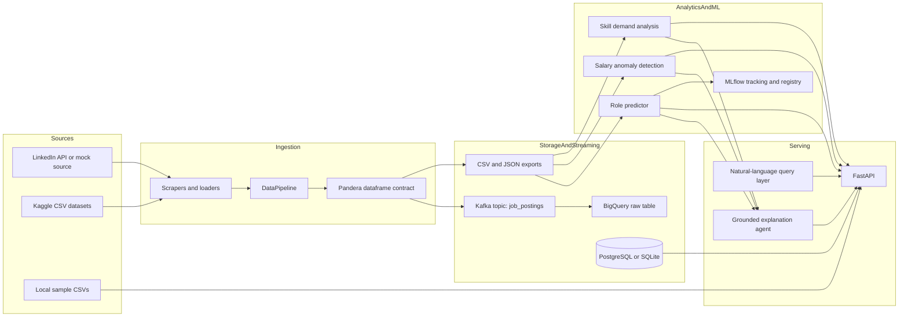

# Job Market Intelligence Platform

A data and ML platform for collecting job postings, validating ingestion quality, analyzing skill and salary trends, tracking role-prediction experiments, and exposing the results through a FastAPI service.

The project is built as a portfolio-grade slice of a real analytics system: typed configuration, schema contracts, reproducible local workflows, MLflow experiment tracking, tests around data and model behavior, and cloud deployment scaffolding.

## Live Demo

- API docs: [http://localhost:8000/docs](http://localhost:8000/docs) after running `make serve`
- Health check: [http://localhost:8000/health](http://localhost:8000/health) after running `make serve`

Public cloud deployment now defaults to a free-tier AWS EC2 path using Docker Compose and GHCR images, with Terraform/ECS kept as optional production scaffolding. See [INFRASTRUCTURE.md](INFRASTRUCTURE.md) for the deployment path.

## System Architecture



## How Data Flows

1. `DataPipeline` pulls job postings from configured sources: LinkedIn, Kaggle, or local mock/sample data for development.
2. Source records are normalized into `JobPosting` models, then converted into a dataframe at pipeline boundaries.
3. A Pandera schema validates the outgoing batch before Kafka publishing or CSV/JSON export. Required fields must be present, salaries must be positive when provided, `salary_max` cannot be below `salary_min`, and `posted_date` cannot be in the future.
4. Validated data can be exported locally, sent to Kafka, loaded into BigQuery by the consumer, or used directly by analytics modules.
5. Analytics services compute skill demand, related skills, salary premiums, and salary anomalies.
6. The role predictor builds text, categorical, and numeric features, trains a scikit-learn model, and logs metrics/artifacts/model versions to MLflow.
7. The explanation agent retrieves the relevant job posting, analysis output, and salary context before producing a grounded narrative.
8. FastAPI serves pipeline status, job statistics, skill reports, role forecasts, salary anomaly results, agent explanations, CSV exports, and lightweight natural-language query responses.

## Key Design Decisions

- **Kafka is included as a streaming boundary, not just decoration.** Ingestion validates records before publishing to the `job_postings` topic, and the consumer is responsible for BigQuery loading. The rationale is documented in [docs/decisions/001-why-kafka.md](docs/decisions/001-why-kafka.md).
- **Data quality is enforced at dataframe boundaries.** Pydantic validates individual job objects; Pandera validates whole batches before they leave the pipeline. This caught a real development bug where sparse Kaggle salary fields could become fake `0` salaries.
- **Configuration is typed and environment-driven.** `config/settings.py` uses a Pydantic settings model loaded from environment variables and `.env`. Secrets, paths, Kafka settings, MLflow settings, and model hyperparameters are not buried in scripts.
- **The local path is intentionally reproducible.** `make ingest`, `make train`, `make serve`, and `make test` provide stable developer workflows instead of relying on README command sequencing.
- **Model tracking is treated as part of the system.** MLflow logs dataset fingerprints, evaluation metrics, reports, confusion matrices, model artifacts, and optional registry versions.
- **The agent is evidence-first.** The first agent layer does retrieval, tool tracing, and grounded narration over existing analytics outputs. A hosted LLM can replace the narration step later without changing the evidence contract.
- **Tests cover engineering risk rather than chasing vanity coverage.** The suite includes feature-engineering unit tests, schema validation tests on pipeline output, and model performance regression tests against configurable baseline thresholds.

## Developer Workflow

```bash
make install
make ingest
make train
make serve
make test
```

Useful overrides:

```bash
make ingest LIMIT=25 OUTPUT=data/jobs.json
make ingest FETCH_ARGS='--source linkedin --keyword "Data Engineer"'
make serve HOST=127.0.0.1 PORT=8000
make test PYTEST_ARGS='tests/test_data_pipeline.py -q'
```

Runtime configuration lives in `.env`; use [.env.example](.env.example) as the template.

## API Surface

The FastAPI service exposes:

- `/health`
- `/data/fetch`
- `/analyze/skills`
- `/trends/skills`
- `/skills/{skill_name}/salary-premium`
- `/skills/{skill_name}/related`
- `/predict/roles`
- `/query`
- `/agent/explain`
- `/salary/anomalies`
- `/report/skill-demand`
- `/export/skills-csv`
- `/status/pipeline`
- `/stats/jobs`

When live-ingested jobs are not loaded yet, the API can fall back to the local sample datasets in `data/` for development workflows.

## Repository Map

- `src/data_pipeline/`: ingestion, source parsing, schema validation, Kafka publishing, local exports
- `src/analytics/`: skill demand, related skills, salary premium, and salary anomaly logic
- `src/prediction/`: role prediction, feature engineering, evaluation, MLflow experiment workflow
- `src/api/`: FastAPI application and endpoint orchestration
- `src/nlp/`: lightweight natural-language query handling and grounded agent explanations
- `src/database/`: SQLAlchemy models and repository helpers
- `tests/`: pipeline, schema, feature engineering, model regression, analytics, database, and API tests
- `airflow/`, `dbt/`, `feast/`: orchestration, transformation, and feature-store scaffolding
- `docker-compose.free-tier.yml`, `terraform/`, `k8s/`, `Dockerfile`, `docker-compose.yml`: free-tier deployment and infrastructure scaffolding

## Current Status

Core local workflows for ingestion, validation, analytics, API serving, testing, and MLflow-backed experimentation are in place. AWS, Docker, Kubernetes, Terraform, Airflow, dbt, and Feast are included as staged infrastructure components rather than claimed production deployments.

## What I Would Improve With More Time

- Deploy the API publicly behind HTTPS and replace the local demo links with a managed live environment.
- Add a scheduled orchestration path that runs ingestion, validation, dbt transformations, feature generation, and retraining as separate observable jobs.
- Replace mock LinkedIn data with a production-safe provider or licensed job-posting dataset.
- Add data drift checks and model monitoring around salary distributions, skill vocabulary shifts, and role-classification confidence.
- Promote the BigQuery/dbt/Feast path from scaffold to fully exercised cloud workflow.
- Add authentication and rate limiting to the API before exposing write-like endpoints publicly.
- Expand CI to run linting, type checks, Docker builds, and targeted integration tests against ephemeral services.

## References

- [INFRASTRUCTURE.md](INFRASTRUCTURE.md): deployment architecture and cloud setup
- [MLFLOW_SETUP.md](MLFLOW_SETUP.md): experiment tracking workflow
- [docs/decisions/001-why-kafka.md](docs/decisions/001-why-kafka.md): Kafka architecture decision record
